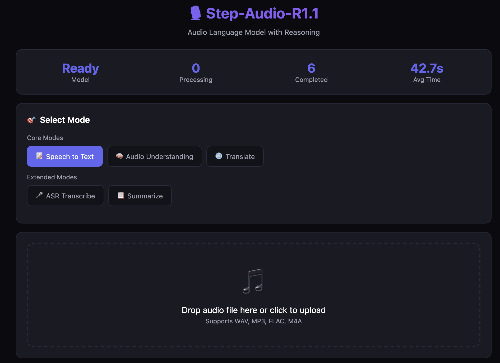

<p align="center">
  
</p>

<h1 align="center">Step-Audio-R1.1</h1>

<p align="center">
  <strong>テスト時計算スケーリングを実現した初の音声言語モデル</strong>
</p>

<p align="center">
  <a href="README.md">English</a> | 
  <a href="README_CN.md">简体中文</a> | 
  <a href="README_TW.md">繁體中文</a> | 
  <a href="README_JP.md">日本語</a>
</p>

<p align="center">
  <a href="https://hub.docker.com/r/neosun/step-audio-r1.1"></a>
  <a href="https://github.com/neosu/Step-Audio-R1.1/stargazers"></a>
  <a href="https://huggingface.co/stepfun-ai/Step-Audio-R1.1"></a>
  <a href="https://arxiv.org/pdf/2511.15848"></a>
  <a href="LICENSE"></a>
</p>

---

## 🎯 概要

Step-Audio-R1.1は、**リアルタイム応答性**と**強力な推論能力**を兼ね備えた最先端の音声言語モデルです。テスト時計算スケーリングを初めて実現した音声モデルであり、総合音声ベンチマークでGemini 2.5 Proを上回る性能を達成しています。

<p align="center">
  
</p>

### ✨ 主な機能

| 機能 | 説明 |
|------|------|
| 🎙️ **5つの処理モード** | ASR音声認識、音声テキスト変換、翻訳、要約、理解・質問応答 |
| ⚡ **高並列処理** | 4つの85分音声ファイルを同時処理 |
| 🧠 **深層推論** | 音響特徴に基づく思考連鎖推論 |
| 🐳 **オールインワンDocker** | vLLM + Web UI + APIを単一コンテナに統合 |
| 🌐 **Webインターフェース** | 美しくレスポンシブな音声処理画面 |
| 📡 **REST API** | OpenAI互換APIインターフェース |
| 🔧 **長時間音声対応** | 85分以上の音声を自動分割処理 |

---

## 🚀 クイックスタート

### ステップ1：モデルをダウンロード（必須、約65GB）

```bash
# 方法1：Git LFS（推奨）
git lfs install
git clone https://huggingface.co/stepfun-ai/Step-Audio-R1.1

# 方法2：Hugging Face CLI
pip install huggingface_hub
huggingface-cli download stepfun-ai/Step-Audio-R1.1 --local-dir ./Step-Audio-R1.1
```

### ステップ2：Dockerで実行

```bash
# オールインワンイメージをプル
docker pull neosun/step-audio-r1.1:latest

# 実行（モデルディレクトリをマウント）
docker run --gpus all \
  -v $(pwd)/Step-Audio-R1.1:/model:ro \
  -p 9100:9100 \
  -p 9101:9999 \
  neosun/step-audio-r1.1:latest
```

### または Docker Compose を使用

```bash
# リポジトリをクローン
git clone https://github.com/neosun100/Step-Audio-R1.1.git
cd Step-Audio-R1.1

# モデルをダウンロード（まだの場合）
git lfs install
git clone https://huggingface.co/stepfun-ai/Step-Audio-R1.1

# サービスを起動
docker compose up -d
```

Web UIにアクセス：**http://localhost:9100**

---

## 📦 インストール

### 必要条件

- **GPU**：4× NVIDIA GPU、各40GB以上のVRAM（L40S/H100/H800でテスト済み）
- **Docker**：20.10以上、NVIDIA Container Toolkit付き
- **ストレージ**：モデルファイル用に約65GB

### モデルのダウンロード

```bash
# 方法1：Git LFS
git lfs install
git clone https://huggingface.co/stepfun-ai/Step-Audio-R1.1

# 方法2：Hugging Face CLI
pip install huggingface_hub
huggingface-cli download stepfun-ai/Step-Audio-R1.1 --local-dir ./Step-Audio-R1.1
```

### 設定

テンプレートから `.env` ファイルを作成：

```bash
cp .env.example .env
```

| 変数 | デフォルト | 説明 |
|------|------------|------|
| `WEB_PORT` | 9100 | Web UIポート |
| `VLLM_PORT` | 9101 | vLLM APIポート |
| `MODEL_PATH` | ./Step-Audio-R1.1 | モデルファイルパス |
| `TENSOR_PARALLEL_SIZE` | 4 | GPU数 |
| `MAX_NUM_SEQS` | 4 | 最大同時リクエスト数 |
| `GPU_MEMORY_UTILIZATION` | 0.85 | GPUメモリ使用率 |

---

## 🎮 使用方法

### Webインターフェース

`http://localhost:9100` にアクセス：
1. 音声ファイルをアップロード（WAV、MP3、FLAC、M4A）
2. 処理モードを選択
3. 「処理」をクリックして結果を待つ

### API呼び出し

```bash
# 音声ファイルを処理
curl -X POST http://localhost:9100/api/process \
  -F "audio=@your_audio.wav" \
  -F "mode=summarize"

# 利用可能なモード：asr, s2t, translate, summarize, understand
```

### Pythonサンプル

```python
import requests

with open("audio.wav", "rb") as f:
    response = requests.post(
        "http://localhost:9100/api/process",
        files={"audio": f},
        data={"mode": "understand", "question": "何について議論されていますか？"}
    )
print(response.json()["answer"])
```

### 長時間音声処理

85分以上の音声には、スマートプロセッサを使用：

```bash
python smart_audio_processor.py input.wav -m summarize -o output.json -p 4
```

---

## 📊 ベンチマーク結果

### 処理モード比較（5分音声）

| モード | 時間 | 出力 | 用途 |
|--------|------|------|------|
| ASR | 52.8秒 | 4,496文字 | 正確な文字起こし |
| S2T | 46.8秒 | 3,713文字 | 構造化ノート |
| Translate | 51.7秒 | 1,690文字 | 多言語理解 |
| Summarize | 26.0秒 | 1,637文字 | 概要把握 |
| Understand | 29.5秒 | 2,025文字 | 深層分析 |

### 並列処理テスト（4×85分音声）

| モード | 成功率 | 合計時間 |
|--------|--------|----------|
| 全モード | 20/20 ✅ | 約250秒/組 |

---

## 🤝 コントリビューション

コントリビューションを歓迎します！お気軽にPull Requestを送信してください。

1. リポジトリをフォーク
2. 機能ブランチを作成 (`git checkout -b feature/AmazingFeature`)
3. 変更をコミット (`git commit -m 'Add some AmazingFeature'`)
4. ブランチにプッシュ (`git push origin feature/AmazingFeature`)
5. Pull Requestを作成

---

## 📝 更新履歴

### v1.1.0 (2026-01-18)
- ✨ vLLM + Web UIを含むオールインワンDockerイメージ
- ✨ 4つの85分音声の同時並列処理をサポート
- ✨ 任意の長さの音声に対応するスマート音声プロセッサ
- ✨ 包括的なベンチマークレポート
- 🐛 長時間音声のASR切り捨て問題を修正
- 📚 多言語ドキュメントサポート

### v1.0.0 (2026-01-14)
- 🎉 Step-Audio-R1.1 初回リリース
- ✨ 5つの処理モード（ASR、S2T、翻訳、要約、理解）
- ✨ Web UIとREST API

---

## 📄 ライセンス

このプロジェクトはApache License 2.0の下でライセンスされています - 詳細は[LICENSE](LICENSE)ファイルをご覧ください。

---

## 🙏 謝辞

- [StepFun AI](https://github.com/stepfun-ai) - オリジナルのStep-Audio-R1モデルを提供
- [vLLM](https://github.com/vllm-project/vllm) - 高性能推論エンジンを提供

---

## ⭐ Star履歴

[](https://star-history.com/#neosu/Step-Audio-R1.1)

---

## 📱 フォローする

<p align="center">
  
</p>

---

<p align="center">
  Made with ❤️ by <a href="https://github.com/neosu">NeoSu</a>
</p>
